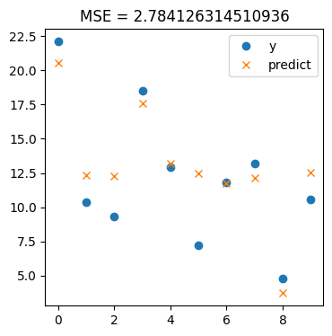
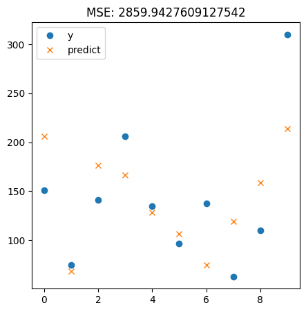

# Modelos de ML

  

Machine Learning vem do aprendizado estatístico e da ciência de dados  
Dado uma entrada ou conjunto de entradas, podemos estimar $f(x)$ e prever resultados ou classificar os dados entre classes diferentes.  

## Tipos de treinamento  

Muito resumidamente, modelos de ML são treinados de forma supervisionada ou não-supervisionada.  
- **Supervisionada**: Quando modelos têm um conjunto de dados e os dados estão rotulados com uma saída para cada conjunto de entradas.  
- **Não-supervisionado**: Quando modelos têm um conjunto de dados sem rótulos, em que as entradas devem ser analisadas pelo modelo.  

## Tipos de modelo  
Nesse repo apresento modelos do tipo **regressão** e **classificação**    
- **Regressão** prevê um resultado contínuo $y$ de acordo com variáveis independentes $x$. Um exemplo é um modelo que lê diversos dados sobre um ambiente e sua temperatura dada as condições e consegue prever alguma temperatura de acordo com as condições passadas como entrada.   

- **Classificação** prevê um resultado discreto $y$ usando variáveis independentes $x$. Um resultado discreto pode significar uma lista finita de respostas em que uma será escolhida de acordo com as entradas, ou uma classificação das entradas em alguma das respostas. Um exemplo é um modelo que classifica se um automóvel é um carro ou uma moto de acordo com as características dos dados (motor, pneus etc).  

## Métricas  

### Métricas de Regressão  

Tendo $x$ como entradas de treinamento, $y$ como saídas para $x$ e $\bar{y}$ a saída prevista pelo modelo:

  

- Erro absoluto Médio (MAE)  

$$
\frac{1}{n} \sum_{i=1}^{n} |( y_i -\bar{y}_i )|
$$

- Erro Quadrático Médio (MSE)

$$
\frac{1}{n} {\sum_{i=1}^{n} (y_i - \bar{y}_i)^2}
$$

### Métricas de Classificação

 

- Acurácia 

$$
\frac{Previsões Corretas}{Total de observações}
$$

- Precisão

$$
\frac{True Positives}{True Positives + False Positives}
$$

- Recall  

$$
\frac{True Positives}{True Positives + False Negatives}
$$

### Exemplos de execução 

- Regressão Linear Simples  
Dados os valores de entrada $x$, o modelo aprende a criar uma relação de previsão de acordo com os valores. A diferença entre o valor previsto e o valor real é o erro. Exemplo no gráfico a seguir.  

  

- Regressão de Ridge  
Mesma propriedade da regressão simples, mas com um fator alpha que suaviza e mantém os coeficientes baixos.  

  

